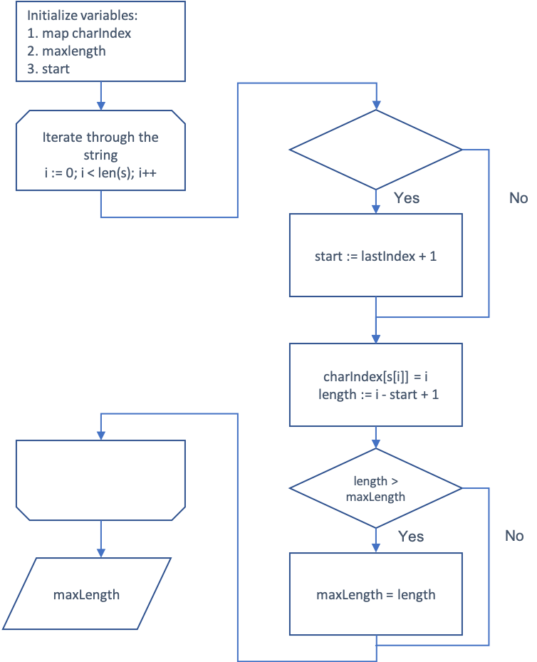

# Add Two Numbers

This Go program demonstrates the
[Longest Substring Without Repeating Characters](https://leetcode.com/problems/longest-substring-without-repeating-characters/description/)
leetcode problem solution.

## Problem Description

Given a string `s`, find the length of the longest substring without repeating characters.

Example:

```
Input: s = "abcabcbb"
Output: 3
Explanation: The answer is "abc", with the length of 3.
```

## Usage

To use this program, follow these steps:

1. Ensure you have Go installed on your system
2. Clone this repository `git clone https://github.com/konstantin-evo/leetcode-problem-solving.git`
3. Navigate to the directory containing the `main.go` file `cd ./3-longest-substring-without-repeating-characters`
4. Run `go run main.go` to execute the program

## Algorithm Description

1. **Initialization**:
    - Create a map `charIndex` to store the last index of each character encountered.
    - Initialize `maxLength` to 0 to track the length of the longest substring.
    - Initialize `start` to 0, indicating the start index of the current substring.

2. **Main Loop**:
    - Iterate over each character `s[i]` in the input string `s`.
    - **Check for Repeating Characters**:
        1. If the current character `s[i]` has been encountered before (exists in `charIndex`), and its last occurrence
           is after or at the start index of the current substring:
            - Update the `start` index to exclude the previous occurrence of `s[i]` by setting `start`
              to `lastIndex + 1`, where `lastIndex` is the last index of `s[i]` stored in `charIndex`.
    - **Update `charIndex` and Calculate Substring Length**:
        - Update the last index of `s[i]` in `charIndex` to the current index `i`.
        - Calculate the length of the current substring as `i - start + 1`.
    - **Update `maxLength`**:
        - If the length of the current substring is greater than the current `maxLength`, update `maxLength` with the
          new length.

3. **Return Result**:
    - Return the final `maxLength` as the result, representing the length of the longest substring without repeating
      characters.

<p align="center">
  
</p>

## Example with Debug Table

A debug table with all variables for the input string "abcabcbb" as an example:

| Iteration | Current Character | charIndex                | start | maxLength | Length |
|-----------|-------------------|--------------------------|-------|-----------|--------|
| 0         | a                 | {'a': 0}                 | 0     | 0         | 1      |
| 1         | b                 | {'a': 0, 'b': 1}         | 0     | 1         | 2      |
| 2         | c                 | {'a': 0, 'b': 1, 'c': 2} | 0     | 2         | 3      |
| 3         | a                 | {'a': 3, 'b': 1, 'c': 2} | 1     | 3         | 2      |
| 4         | b                 | {'a': 3, 'b': 4, 'c': 2} | 2     | 3         | 3      |
| 5         | c                 | {'a': 3, 'b': 4, 'c': 5} | 3     | 3         | 3      |
| 6         | b                 | {'a': 3, 'b': 6, 'c': 5} | 4     | 3         | 2      |
| 7         | b                 | {'a': 3, 'b': 7, 'c': 5} | 5     | 3         | 1      |
